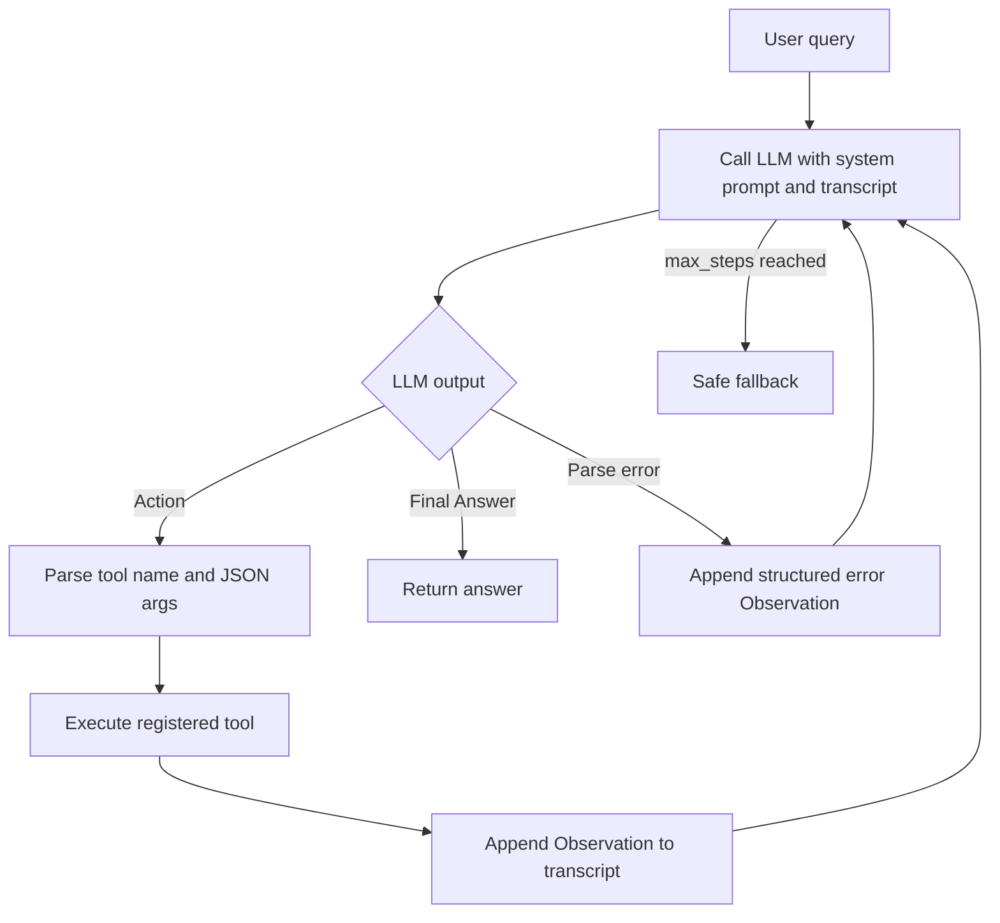

# ReAct Flowchart

```mermaid
flowchart TD
    A[User query] --> B[Call LLM with system prompt and transcript]
    B --> C{LLM output}
    C -->|Action| D[Parse tool name and JSON args]
    D --> E[Execute registered tool]
    E --> F[Append Observation to transcript]
    F --> B
    C -->|Final Answer| G[Return answer]
    C -->|Parse error| H[Append structured error Observation]
    H --> B
    B -->|max_steps reached| I[Safe fallback]
```
